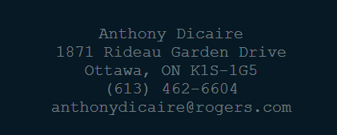

# Resume - Anthony Dicaire

## Palette
- Base Colour : #061924
- Accent Colour : #ffffff6a

## Typography
- Font Family : Gill Sans, Gill Sans MT, **Calibri**, Trebuchet MS, sans-serif
- Contact Info Font Family : Courier New, **Courier**, monospace
- Header Font Size : 32px
- Normal Text Size : 16px

## Components and Layout
### Header
- Design : Centered Text with a white background, rounded corners, and a blue outbound border with the base colour as the text
- Mock up Screenshot :

### Content
- Design : Normal aligned text on a white background with the base colour as the text. There is a header for each block that is bold

### Buttons
- Design : clear backing until selected. On hover, the button background turns white with the base colour as the text colour. The font 
  size also increases by 1 and there is a 0.25 transition
- Functionality : uses JavaScript to define what happens on button press. In this case it will set the state and text of each block

### Contact Info Block
- Design : Accent colour (opacity applied) as the text colour with a link to email

## Conclusion
This is a document describing a reference guide to the structure of the Portfolio Project (a web based resume for Anthony Dicaire).
The goal is to control the design of the project