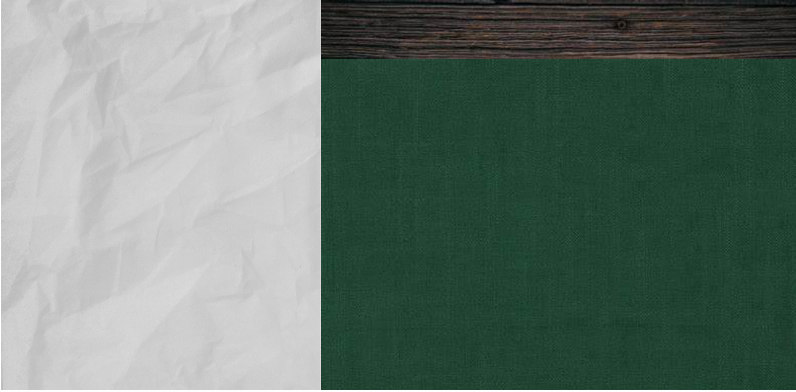

# Yahtzee - Anthony Dicaire

## Description
This application is a clone of the dice game Yahtzee created using HTML, CSS and JS.
It consists of a simple home page with the rules. 

## Rules
- Press the button in the upper left corner of the screen to roll the dice
- Click on a die to put it in the group of held dice. These will not be rolled
- 3 rolls before you have to select a score. Choosing a score that does not have a number scratches it
- Fill out the score card in order to end the game

## Palette
- Text Colour : black (#000000) chosen for contrast against the white paper
- Possible Selection text Colour : dark blue (#0005ad) chosen for visibility against the rest of the board. This is important to have visible as this will be the colour of the options for score that the user chooses.
#0005ad specifically as a lighter version of a friend's favourite colour (#00027a)

## Typography
- Font Family : 'cursive'
- Font Size : 24px, 48px for titles
- Font Styles : Title and headings are bold
I chose this font style as it is sort of supposed to have a 'done on a scrap of paper' feel as a general theme

## Components and Layout
### Structure
There will be a HTML file to display everything and a JS reference to the elements for functionality
The elements are stored in an array and their visibility and interactivity is set via the game state
The game background is a HTML div grid that uses a group of images to draw the game board and score card

### Game State 
- Main Menu : Crumpled paper with the game title and the buttons to start. There is also an easter egg where clicking on the dice in the background rolls them
- Rulebook Screen : Crumpled paper with the game rules and a back button taking you back to the previous state (the previous state is saved as a variable)
- Settings Screen : Crumpled paper with a list of options that you can choose. The back button works the same as the rulebook screen's back button
- Play State : Has the scorecard as a table on the left (on a crumpled piece of paper), a green background with the dice, and a wooden top block for the selected dice. There is a button that rolls the dice in the top left.

### Animations & Functionality
- Upon clicking a die, it glides to the top bar
- The dice bounce to a random position on the screen when rolled
These animations are subtle but effective in the overall feel of the game

- There are some buttons on the bottom of the score card that allow the user to access the options and the rules
- The main menu screen has a button for the rules and a button to start
- Menus such as the options menu and the rules menu have a back button that returns to the previous game state. Said game state is stored when the menus open. On press it takes the player back to that state
- Once the game ends, the score is displayed. You can press 'play again' or 'quit' where 'quit' returns you to the main menu

### Layout

- Dice on click collect at the top alongside the roll button for the dice (top right)
- Score div grid is stored on the left piece of paper
- The dice are rolled on the main green cloth when the roll dice button is pressed

## Conclusion
This is a file describing the details of the Yahtzee game program.
It goes into details on how the program UI is done and the stylistic choices selected for this program.